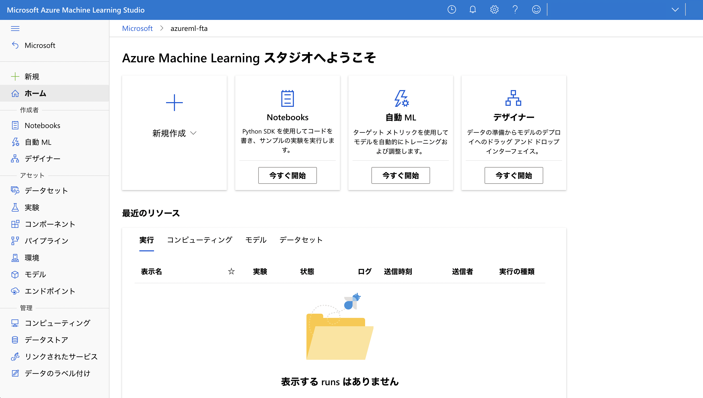
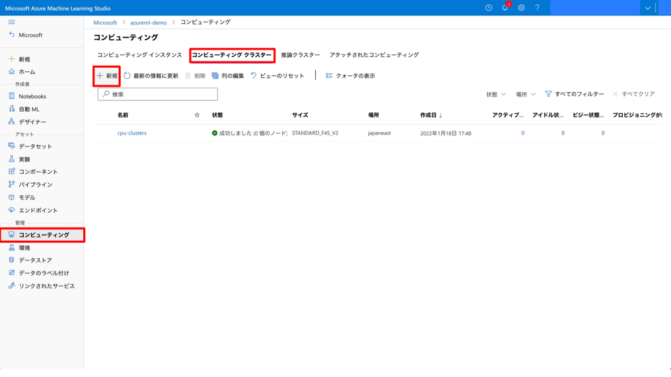
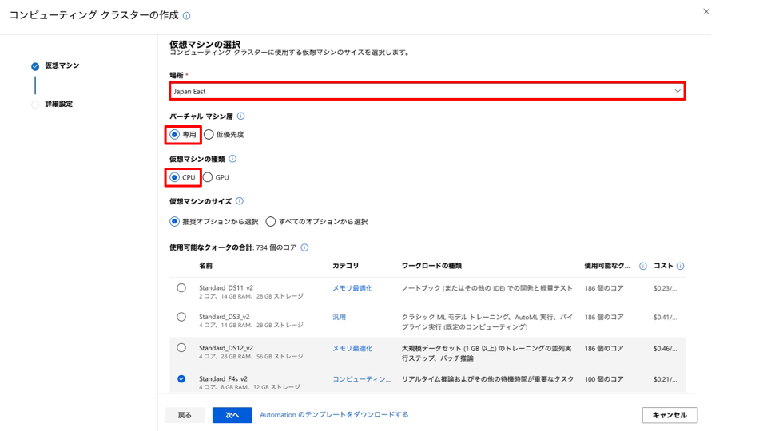
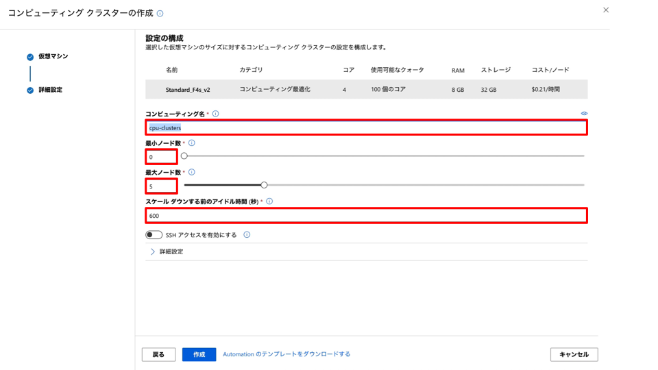
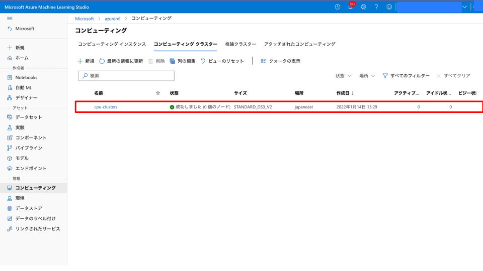
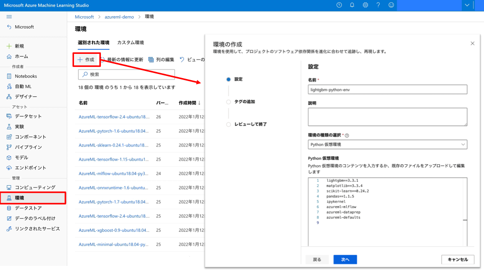
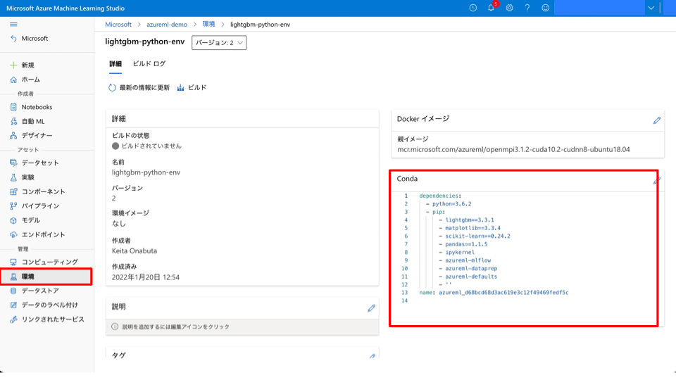
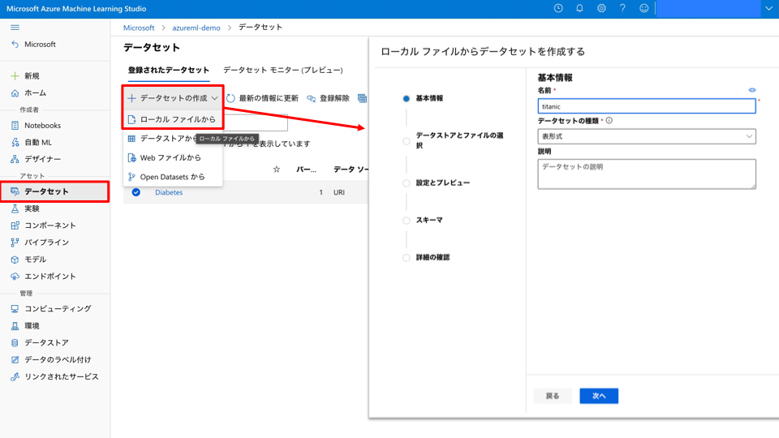
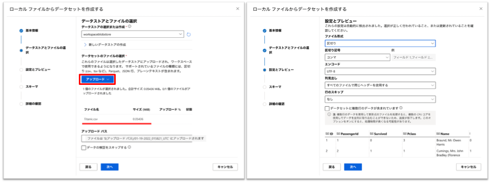
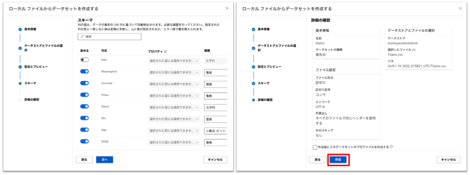

## デモンストレーション : Azure Machine Learning studio 

Azure Machine Learning (aka Azure ML) studio のデモンストレーションの手順を記載します。

### 1. Azure ML studio 画面構成
[ml.azureml.com](ml.azurem.com) にアクセスします。

### 2. コンピューティングインスタンス (Compute Instance) の作成

Azure Machine Learning の Compute Instance を起動します。

コンピューティング (Compute) のコンピューティングインスタンス (Computing Instance) のタブから「新規」をクリックします。

次に、必須の構成に関する情報を設定します。
- コンピューティング名 : Azure の各リージョンでユニークな名前になるように設定
- 仮想マシンの種類 : CPU
- 仮想マシンのサイズ : クォータの余裕があればどの VM シリーズ選んでも OK (4 core 以上を推奨)

Jupyter などの開発環境の起動できることを確認します。

### 3. コンピューティングクラスター (Compute Clusters) の作成
「新規」からコンピューティングクラスターを作成していきます。 
 

(例えば) Standard_F4s_v2 などの VM ファミリーを選択します。 
 

名称は `cpu-clusters` とし、最小ノード数は 0、最大ノード数は 4 などに設定し、コンピューティングクラスターを作成します。 
 

正常に作成されたことを確認します。 
 

### 4. Environments の確認

環境の名称は `lightgbm-python-env` とし、「Python 仮想環境」を選択し、Python ライブラリとそのバージョンが記載されている [../src/environments/requirements.txt](environments/requirements.txt) の内容をコピー&ペーストします。 
次へ進み、内容に誤りない確認をして環境を作成します。 
<!-- TODO:UPDATE -->
  
正常に環境が登録されていることを確認します。 
<!-- TODO:UPDATE -->
 

### 4. データストア (Datastore) の構成確認

<!-- TODO : ADD -->

### 5. Datasets の登録
ブラウザを開いている作業端末に CSV (data フォルダの Titanic.csv) をダウンロードして、データセット (Datasets) として登録します。

データセットの名称は `titanic` として、データセットの種類は _表形式_ とします。 
 
data フォルダの Titanic.csv データをアップロードします。次にファイル形式、区切り記号などの情報に誤りがないことを確認して次に進みます。 
  
スキーマの設定に誤りがないことを確認して次に進み、データセットの登録を完了します。 
   
正常に登録されていることを確認します。 
 

### 6. Notebooks によるモデル学習

<!-- TODO:ADD -->

<h4> 注意 </h4>

Azure Machine Learning から Job を実行する機能はプレビューです。 

### 7. AutoML

<!-- TODO:ADD -->

### 8. Designer

<!-- TODO:ADD -->

1. Azure ML studio 画面構成の説明をします。
2. Compute Instance を作成します。
    - スケジューリング機能の設定
3. Compute Clusters を作成します。
    - CPU タイプで最大 4 ノードの設定値
4. Datastore (データストア) の機能の説明をします。
    - Credentail vs Identity 認証方法の違い
5. Datasets (データセット) の機能の説明をします。
    - Titanic 号データをアップロード
    - プロファイルを作成しヒストグラムなどの情報を表示
    - Python SDK サンプルコードの紹介
6. Notebooks の画面構成を紹介します。
    - 空の Jupyter Notebook を作成
    - Compute Instance の指定
    - セルの操作
    - サンプルコードのインポート
7. AutoML で機械学習モデルを構築します。
    - データセットを選択
    - ターゲット列、計算環境の選択
    - 機械学習タスクの選択
    - 詳細設定 : 学習時間の設定
    - 交差検証の設定
    - 結果の確認
        - 学習済みモデルの一覧確認
        - 実験のメタデータの確認 
        - メトリック、パラメータの確認
        - 説明性の確認
    - Web サービス (ACI) へのデプロイ
8. Designer で機械学習パイプラインを構築します。
    - サンプルのパイプラインをオープン
    - モデル学習のパイプラインを実行
    - 推論パイプラインを構築し実行

