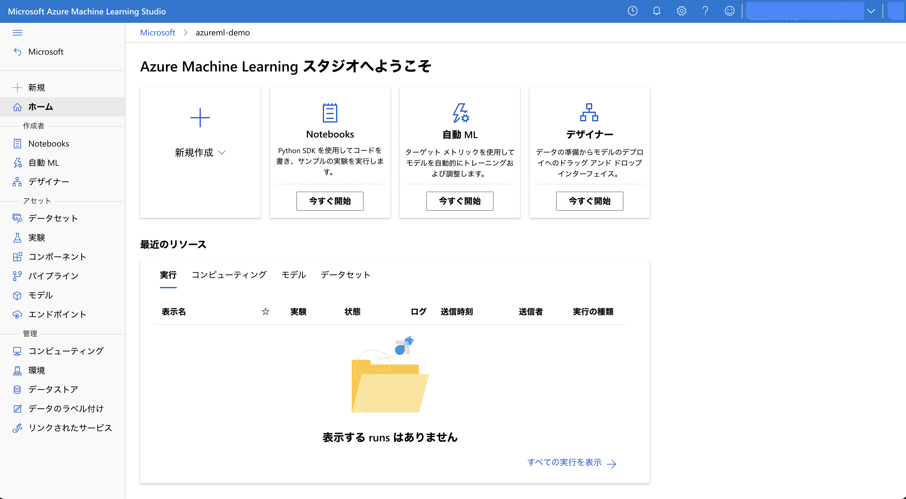
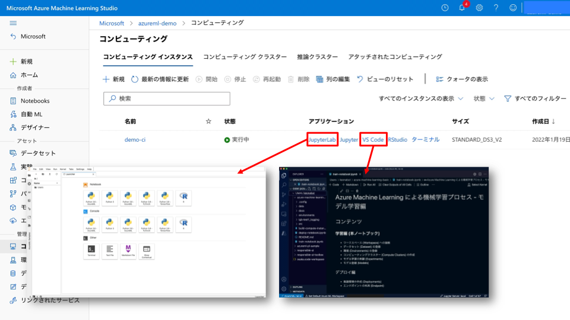

## デモンストレーション : Azure Machine Learning Studio 

Azure Machine Learning Studio (aka Azure ML Studio) のデモンストレーションの手順を記載します。

 

### 1. Azure ML Studio 画面構成
[ml.azureml.com](ml.azurem.com) にアクセスします。

 

### 2. コンピューティングインスタンス (Compute Instance) の作成

Azure Machine Learning の Compute Instance を起動します。

コンピューティング (Compute) のコンピューティングインスタンス (Computing Instance) のタブから「新規」をクリックします。

次に、必須の構成に関する情報を設定します。
- コンピューティング名 : Azure の各リージョンでユニークな名前になるように設定
- 仮想マシンの種類 : CPU
- 仮想マシンのサイズ : クォータの余裕があればどの VM シリーズ選んでも OK (4 core 以上を推奨)

Jupyter などの開発環境の起動できることを確認します。

 

### 3. コンピューティングクラスター (Compute Clusters) の作成
「新規」からコンピューティングクラスターを作成していきます。 
 

(例えば) Standard_F4s_v2 などの VM ファミリーを選択します。 
 

名称は `cpu-clusters` とし、最小ノード数は 0、最大ノード数は 4 などに設定し、コンピューティングクラスターを作成します。 
 

正常に作成されたことを確認します。 
 

 

### 4. Environments の作成

環境の名称は `lightgbm-python-env` とし、「Python 仮想環境」を選択し、Python ライブラリとそのバージョンが記載されている [../src/environments/conda-env.yml](../src/environments/conda-env.yml) の内容をコピー&ペーストします。 
次へ進み、内容に誤りない確認をして環境を作成します。 
<!-- TODO:UPDATE Screenshot-->
  
正常に環境が登録されていることを確認します。 
<!-- TODO:UPDATE Screenshot -->
 

 

### 5. データストア (Datastores) の構成確認

<!-- TODO : ADD Screenshot-->
いくつかのデータストア (Datastores) が登録済みですが、その中でもデータセット (Datasets) 作成時にデフォルトで利用されるデータストアの "workspaceblobstore" を選択します。

表示される画面に接続先の Azure Blob Storage の情報が表示されていたり、"認証の更新"をクリックすることで、認証方法を設定・変更することができます。

今回のデモンストレーションではデータストア (Datastores) の存在は意識しなくても操作できますが、Azure ML Workspace に新たにデータソースを接続したい場合は理解しておく必要があります。

 

### 5. データセット (Datasets) の登録
モデル学習に必要なデータセット (Datasets) を作成します。
今回はデータストアにあるデータを利用するのではなく、ブラウザを開いている作業端末に CSV (data フォルダの [Titanic.csv](../src/data/Titanic.csv)) をダウンロードして、データセット (Datasets) として登録します。アップロード時に自動的にデフォルトのデータストアである "workspaceblobstore" にファイルが保存されています。

データセットの名称は `titanic` として、データセットの種類は _表形式_ とします。 
 
data フォルダの Titanic.csv データをアップロードします。次にファイル形式、区切り記号などの情報に誤りがないことを確認して次に進みます。 
  
スキーマの設定に誤りがないことを確認して次に進み、データセットの登録を完了します。 
   
正常に登録されていることを確認します。 
 

### 6. Notebooks によるモデル学習

<!-- TODO:ADD Screenshot-->

Compute Instance を利用したコードを開発・編集・実行することができます。インターフェースとして、Azure ML Studio に統合された Notebooks を利用することができます。

他には Compute Instance が対応している開発環境として Jupyter、JupyterLab、VSCode、R Studio が選択できます。

### 7. AutoML

<!-- TODO:ADD Screenshot-->

自動機械学習 (AutoML) は Azure ML Studio もしくは Azure ML Python SDK などのコードから実行することができます。Azure ML Studio での実行はあまり細かい設定はできませんが、機械学習のタスクに対応しているデータセット (Datasets) があれば簡単に実行することができます。

"新しい自動 ML の実行" をクリックして自動機械学習の設定を始めます。

 

最初に対象のデータセット (Datasets) である `Titanic` を選択します。

 

任意の実験名を記入し、予測の対象をする変数であるターゲット変数を選択します。Titanic 号のサンプルデータでは `Surviced` を選択します。計算環境としてコンピューティングクラスター (Compute Clusters) の `cpu-clusters` を選択します。

 

機械学習のタスクを設定します。今回は "分類" を選択します。

 

次に検証方法として "k 分割交差検証" (クロスバリデーション) を "5" のクエス検証数で設定し、テストデータを学習データからランダムに 10 % 設定します。"終了" を押下して自動機械学習によるモデル学習を開始します。

 

モデル学習が始まると "状態" が "実行中 モデルトレーニング" と表示されます。

 

モデル学習が完了すると "状態" が "完了" と表示されます。また左上の "最適なモデルの概要" セクションから最終的に精度が一番高かったアルゴリズムや精度の情報などが表示されます。

 

"データガードレール" タブではモデル学習前のデータ前処理におけるデータ品質の確認結果が表示されます。

 

"モデル" タブでは試行されたモデルの一覧が確認できます。一番精度が高い試行に関してはデフォルトで説明性が付与されます。

 

一番精度が高かったモデルの詳細を確認します。

 

"メトリック"タブでは、モデルの精度が数値やチャートから確認できます。

 

"データ変換 (プレビュー)"タブでは、データ前処理の流れを確認することができます。

 

"説明 (プレビュー)" ではモデル説明性を確認することができます。説明 ID が二つありますが、上の方はデータ前処理を実行する前の変数名で表示され、下の方はデータ前処理後の変数名で表示されるという違いあります。

 

細かいログは "出力とロブ"タブから確認することができます。

 

以上までがモデル学習の部分です。以下、モデルのエンドポイント (Endpoints) の作成を進めていきます。

今回は Azure Container Instance に学習済みモデルを Web サービスとしてデプロイします。リアルタイム推論の形態です。"デプロイ"ボタンから "Web サービスへの配置" をクリックします。

 

エンドポイントの名前を入力し、コンピューティングの種類として "Azure コンテナーインスタンス" を選択します。この環境は主にテスト用に用いられます。本番用途であれば Azure Kubernetes Services にデプロイすることを推奨します。

自動機械学習 (AutoML) のモデルであればコードの開発や環境 (Environments) の設定は不要です。Azure ML 側で自動で実行されます (モデルがお客様自身で開発されたものであれば推論コードや環境設定が必要です)し、カスタマイズすることも可能です。"デプロイ" をクリックしてデプロイメントを開始します。

 

デプロイが完了するとエンドポイントが生成され、利用したモデルの情報などのメタデータが確認できます。

 

"テスト"タブではモデルにテストデータをインプットし予測値を取得することができます。

 

また "使用"タブからは、Python や C# から利用するためのサンプルコードが表示されます。

 

### 8. Designer

<!-- TODO:ADD -->

